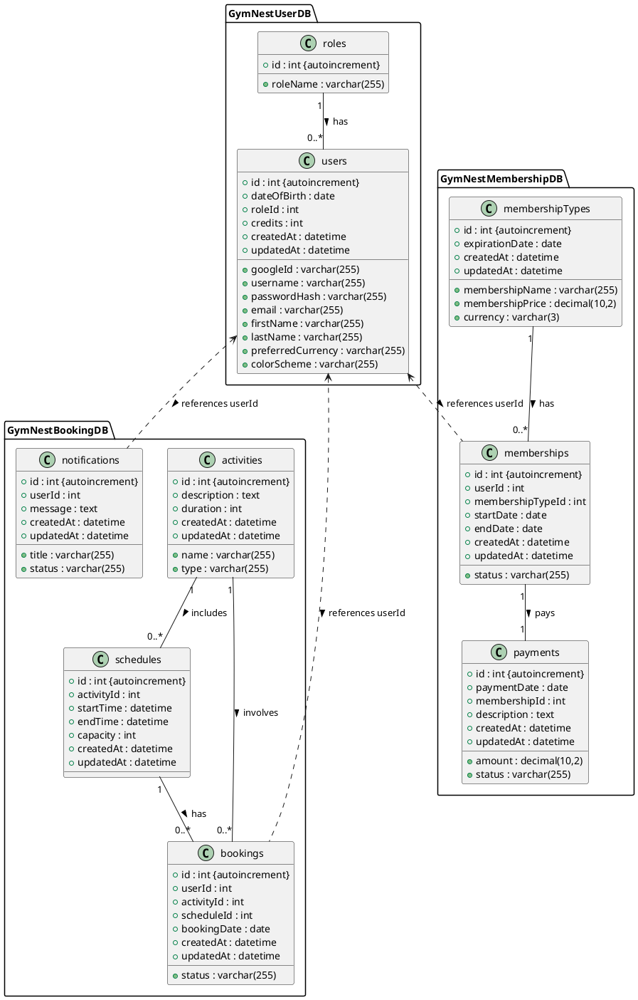

# Class Diagram

## PlantUML code

```plantuml
@startuml
package "GymNestUserDB" {
    class roles {
      + id : int {autoincrement}
      + roleName : varchar(255)
    }

    class users {
      + id : int {autoincrement}
      + googleId : varchar(255)
      + username : varchar(255)
      + passwordHash : varchar(255)
      + email : varchar(255)
      + firstName : varchar(255)
      + lastName : varchar(255)
      + dateOfBirth : date
      + roleId : int
      + preferredCurrency : varchar(255)
      + credits : int
      + colorScheme : varchar(255)
      + createdAt : datetime
      + updatedAt : datetime
    }

    roles "1" -- "0..*" users : has >
}

package "GymNestMembershipDB" {
    class memberships {
      + id : int {autoincrement}
      + userId : int
      + membershipTypeId : int
      + startDate : date
      + endDate : date
      + status : varchar(255)
      + createdAt : datetime
      + updatedAt : datetime
    }

    class membershipTypes {
      + id : int {autoincrement}
      + membershipName : varchar(255)
      + membershipPrice : decimal(10,2)
      + currency : varchar(3)
      + expirationDate : date
      + createdAt : datetime
      + updatedAt : datetime
    }

    class payments {
      + id : int {autoincrement}
      + amount : decimal(10,2)
      + paymentDate : date
      + status : varchar(255)
      + membershipId : int
      + description : text
      + createdAt : datetime
      + updatedAt : datetime
    }

    membershipTypes "1" -- "0..*" memberships : has >
    memberships "1" -- "1" payments : pays >
}

package "GymNestBookingDB" {
    class activities {
      + id : int {autoincrement}
      + name : varchar(255)
      + description : text
      + type : varchar(255)
      + duration : int
      + createdAt : datetime
      + updatedAt : datetime
    }

    class schedules {
      + id : int {autoincrement}
      + activityId : int
      + startTime : datetime
      + endTime : datetime
      + capacity : int
      + createdAt : datetime
      + updatedAt : datetime
    }

    class bookings {
      + id : int {autoincrement}
      + userId : int
      + activityId : int
      + scheduleId : int
      + status : varchar(255)
      + bookingDate : date
      + createdAt : datetime
      + updatedAt : datetime
    }

    class notifications {
      + id : int {autoincrement}
      + userId : int
      + title : varchar(255)
      + message : text
      + status : varchar(255)
      + createdAt : datetime
      + updatedAt : datetime
    }

    activities "1" -- "0..*" schedules : includes >
    schedules "1" -- "0..*" bookings : has >
    activities "1" -- "0..*" bookings : involves >
}

users <.. memberships : references userId >
users <.. bookings : references userId >
users <.. notifications : references userId >
@enduml
```
