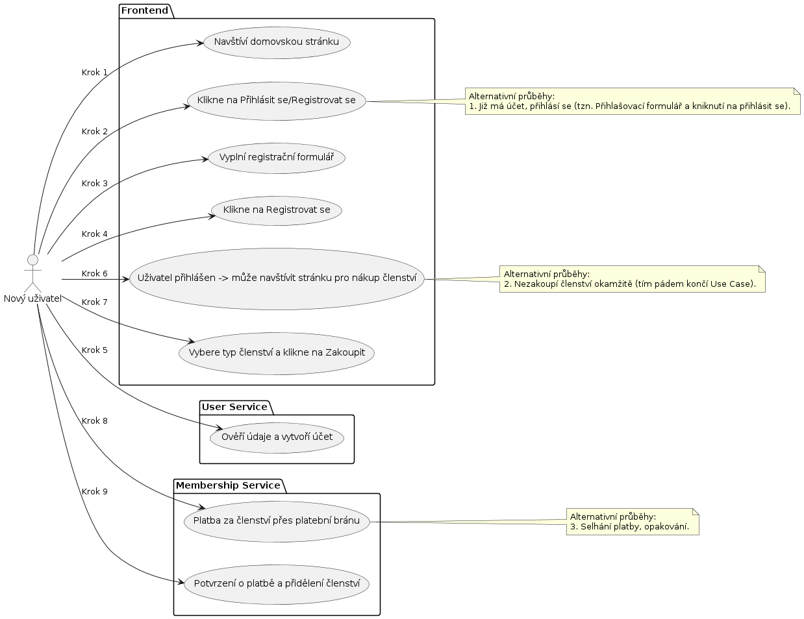
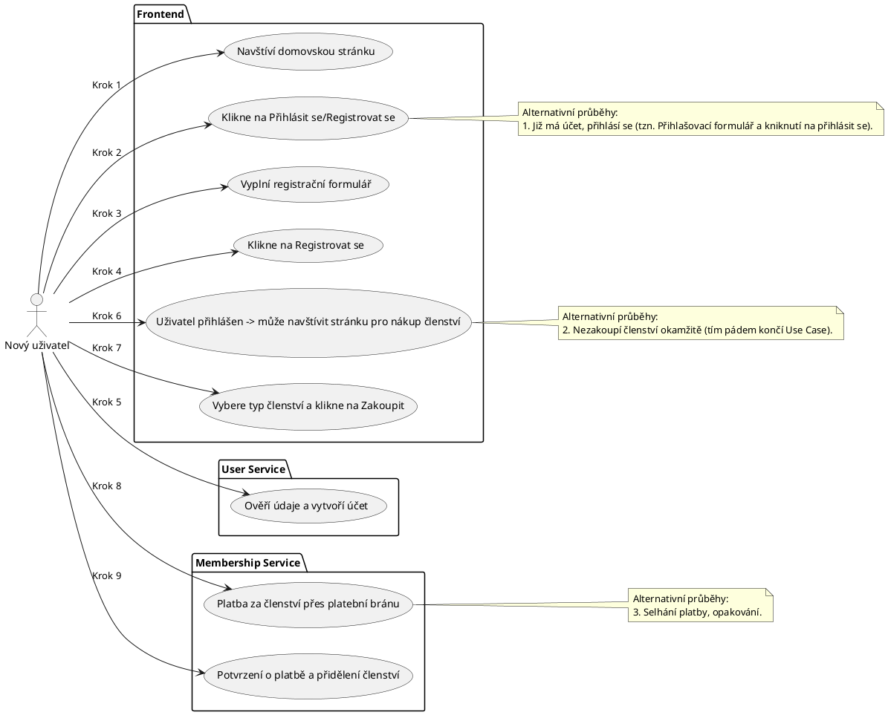
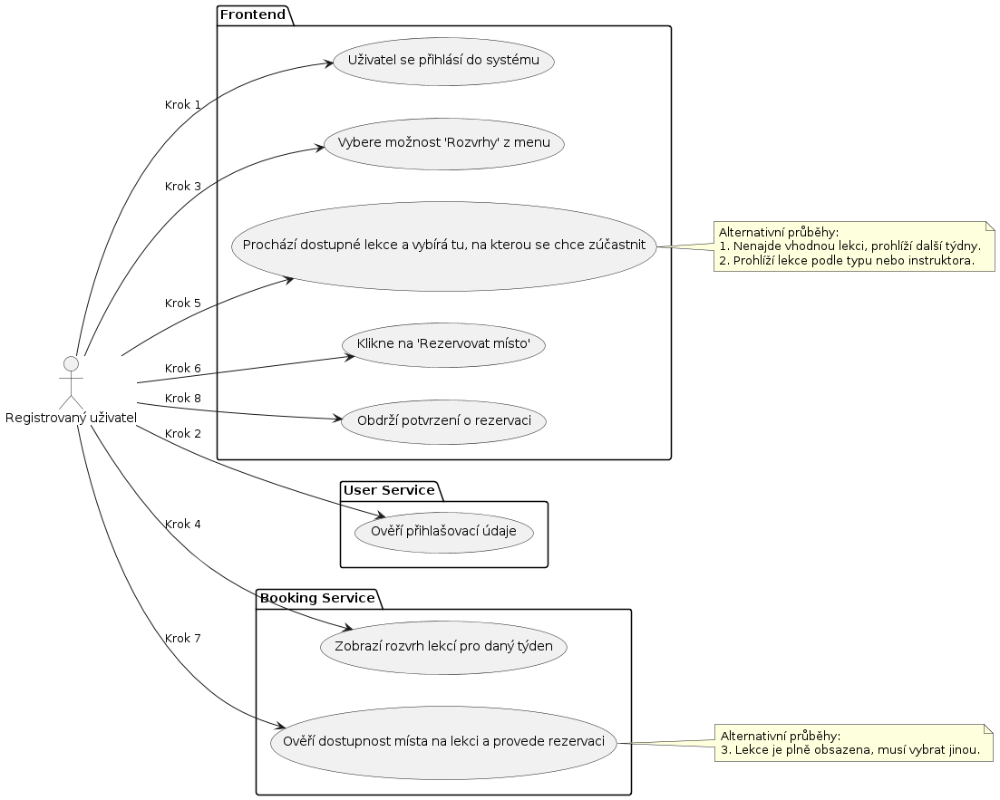
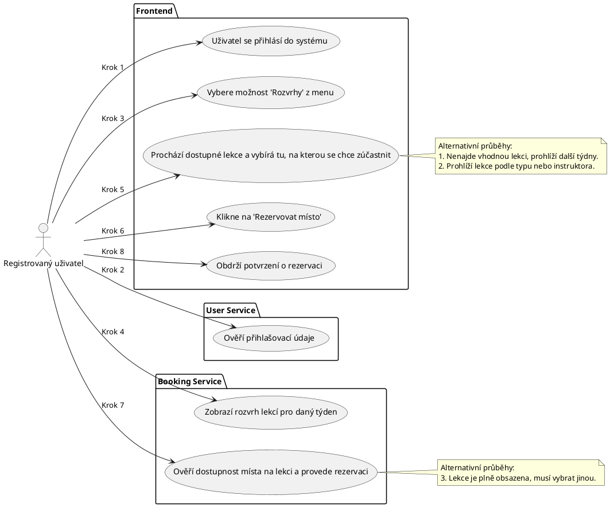
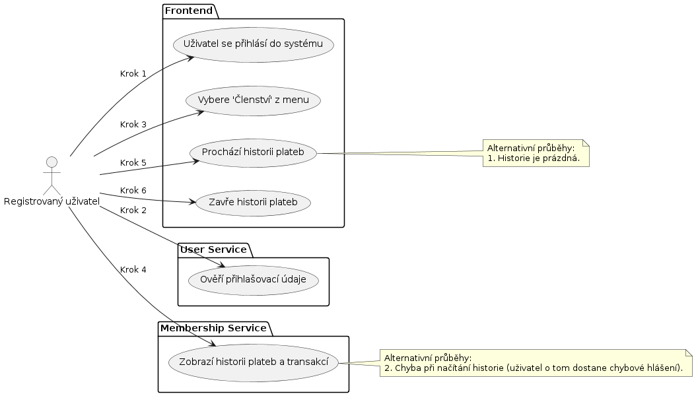
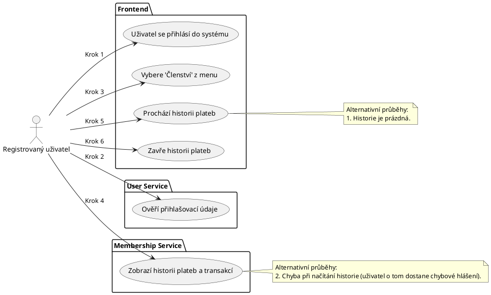
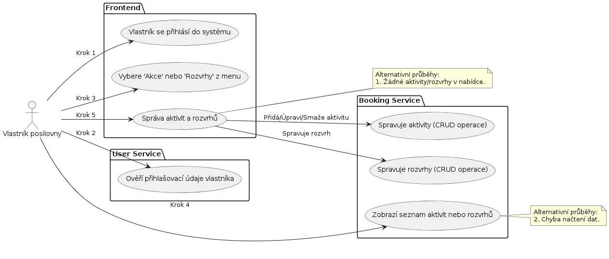
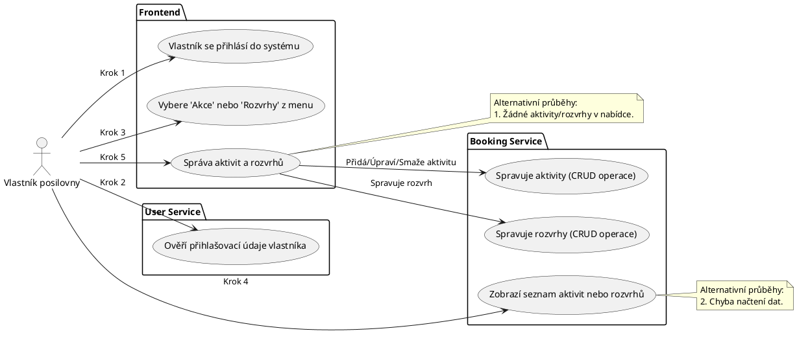

# 1. Use Case

## PlantUML code

```plantuml
@startuml
left to right direction

actor "Nový uživatel" as NewUser

package "Frontend" {
    usecase "Navštíví domovskou stránku" as VisitHomePage
    usecase "Klikne na Přihlásit se/Registrovat se" as ClickLoginRegister
    usecase "Vyplní registrační formulář" as FillForm
    usecase "Klikne na Registrovat se" as ClickRegister
    usecase "Uživatel přihlášen -> může navštívit stránku pro nákup členství" as RedirectToMembership
    usecase "Vybere typ členství a klikne na Zakoupit" as ChooseBuyMembership
}

package "User Service" {
    usecase "Ověří údaje a vytvoří účet" as VerifyCreate
}

package "Membership Service" {
    usecase "Platba za členství přes platební bránu" as PaymentGateway
    usecase "Potvrzení o platbě a přidělení členství" as ConfirmMembership
}

' Propojení aktéra s mikroslužbami
NewUser --> VisitHomePage : "Krok 1"
NewUser --> ClickLoginRegister : "Krok 2"
NewUser --> FillForm : "Krok 3"
NewUser --> ClickRegister : "Krok 4"
NewUser --> VerifyCreate : "Krok 5"
NewUser --> RedirectToMembership : "Krok 6"
NewUser --> ChooseBuyMembership : "Krok 7"
NewUser --> PaymentGateway : "Krok 8"
NewUser --> ConfirmMembership : "Krok 9"

note right of ClickLoginRegister : Alternativní průběhy:\n1. Již má účet, přihlásí se (tzn. Přihlašovací formulář a kniknutí na přihlásit se).
note right of RedirectToMembership: Alternativní průběhy:\n2. Nezakoupí členství okamžitě (tím pádem končí Use Case).
note right of PaymentGateway : Alternativní průběhy:\n3. Selhání platby, opakování.
@enduml
```

# 2. Use Case

## PlantUML code

```plantuml
@startuml
left to right direction

actor "Registrovaný uživatel" as RegisteredUser

package "Frontend" {
    usecase "Uživatel se přihlásí do systému" as UserLogin
    usecase "Vybere možnost 'Rozvrhy' z menu" as SelectSchedule
    usecase "Prochází dostupné lekce a vybírá tu, na kterou se chce zúčastnit" as BrowseClasses
    usecase "Klikne na 'Rezervovat místo'" as ReservePlace
    usecase "Obdrží potvrzení o rezervaci" as Confirmation
}

package "User Service" {
    usecase "Ověří přihlašovací údaje" as VerifyLogin
}

package "Booking Service" {
    usecase "Zobrazí rozvrh lekcí pro daný týden" as DisplaySchedule
    usecase "Ověří dostupnost místa na lekci a provede rezervaci" as CheckAvailability
}

' Propojení aktéra s mikroslužbami
RegisteredUser --> UserLogin : "Krok 1"
RegisteredUser --> VerifyLogin : "Krok 2"
RegisteredUser --> SelectSchedule : "Krok 3"
RegisteredUser --> DisplaySchedule : "Krok 4"
RegisteredUser --> BrowseClasses : "Krok 5"
RegisteredUser --> ReservePlace : "Krok 6"
RegisteredUser --> CheckAvailability : "Krok 7"
RegisteredUser --> Confirmation : "Krok 8"

note right of BrowseClasses: Alternativní průběhy:\n1. Nenajde vhodnou lekci, prohlíží další týdny.\n2. Prohlíží lekce podle typu nebo instruktora.
note right of CheckAvailability: Alternativní průběhy:\n3. Lekce je plně obsazena, musí vybrat jinou.
@enduml
```

# 3. Use Case

## PlantUML code

```plantuml
@startuml
left to right direction

actor "Registrovaný uživatel" as RegisteredUser

package "Frontend" {
    usecase "Uživatel se přihlásí do systému" as UserLogin
    usecase "Vybere 'Členství' z menu" as SelectPaymentHistory
    usecase "Prochází historii plateb" as BrowsePaymentHistory
    usecase "Zavře historii plateb" as ClosePaymentHistory
}

package "User Service" {
    usecase "Ověří přihlašovací údaje" as VerifyLogin
}

package "Membership Service" {
    usecase "Zobrazí historii plateb a transakcí" as DisplayPaymentHistory
}

' Propojení aktéra s mikroslužbami
RegisteredUser --> UserLogin : "Krok 1"
RegisteredUser --> VerifyLogin : "Krok 2"
RegisteredUser --> SelectPaymentHistory : "Krok 3"
RegisteredUser --> DisplayPaymentHistory : "Krok 4"
RegisteredUser --> BrowsePaymentHistory : "Krok 5"
RegisteredUser --> ClosePaymentHistory : "Krok 6"

note right of BrowsePaymentHistory: Alternativní průběhy:\n1. Historie je prázdná.
note right of DisplayPaymentHistory : Alternativní průběhy:\n2. Chyba při načítání historie (uživatel o tom dostane chybové hlášení).
@enduml
```

# 4. Use Case

## PlantUML code

```plantuml
@startuml
left to right direction

actor "Vlastník posilovny" as GymOwner

package "Frontend" {
    usecase "Vlastník se přihlásí do systému" as OwnerLogin
    usecase "Vybere 'Akce' nebo 'Rozvrhy' z menu" as SelectManagement
    usecase "Správa aktivit a rozvrhů" as ManageActivities
}

package "User Service" {
    usecase "Ověří přihlašovací údaje vlastníka" as VerifyOwnerLogin
}

package "Booking Service" {
    usecase "Zobrazí seznam aktivit nebo rozvrhů" as DisplayActivitiesSchedules
    usecase "Spravuje aktivity (CRUD operace)" as ManageActivity
    usecase "Spravuje rozvrhy (CRUD operace)" as ManageSchedule
}

' Propojení aktéra s mikroslužbami
GymOwner --> OwnerLogin : "Krok 1"
GymOwner --> VerifyOwnerLogin : "Krok 2"
GymOwner --> SelectManagement : "Krok 3"
GymOwner --> DisplayActivitiesSchedules : "Krok 4"
GymOwner --> ManageActivities : "Krok 5"
ManageActivities --> ManageActivity : "Přidá/Úpraví/Smaže aktivitu"
ManageActivities --> ManageSchedule : "Spravuje rozvrh"

note right of ManageActivities: Alternativní průběhy:\n1. Žádné aktivity/rozvrhy v nabídce.
note right of DisplayActivitiesSchedules: Alternativní průběhy:\n2. Chyba načtení dat.
@enduml
```